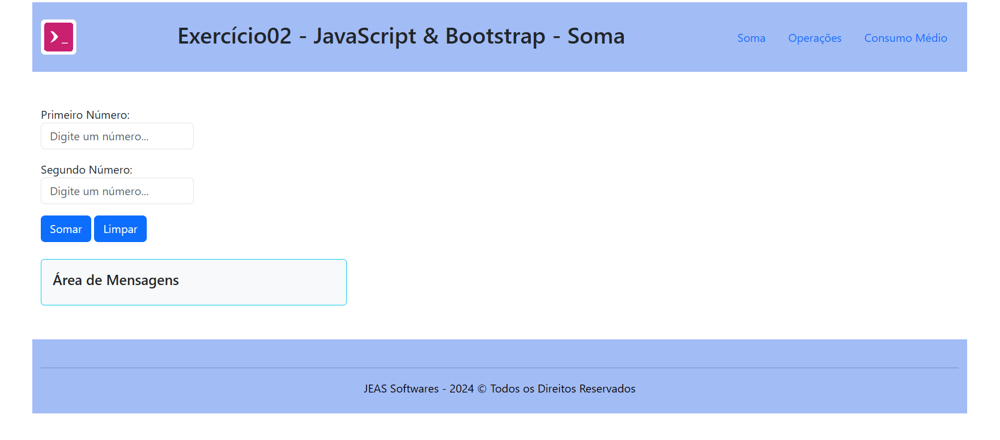

# Exercício-02 - JavaScript & Bootstrap

Este projeto foi desenvolvido como parte da disciplina de Desenvolvimento Full Stack, ministrada pelo professor Eduardo Rosseo na **Digital College**. O objetivo principal deste exercício é aplicar os conceitos de **JavaScript** e **Bootstrap 4** para resolver problemas matemáticos básicos de forma interativa através de uma aplicação web simples.

## Funcionalidades

O site consiste em três funcionalidades principais que permitem ao usuário realizar cálculos matemáticos de forma prática e intuitiva:

1. **Calculadora Simples**:
   - Recebe dois números como entrada e retorna o resultado da **soma**.
   - Implementado no arquivo [soma.html](src/soma.html).

2. **Calculadora Completa**:
   - Realiza as quatro operações matemáticas básicas: **Soma**, **Subtração**, **Multiplicação** e **Divisão**.
   - Implementado no arquivo [operacoes.html](src/operacoes.html).

3. **Cálculo de Consumo Médio**:
   - Calcula o **consumo médio de combustível** de um veículo, recebendo como entrada a distância percorrida e a quantidade de combustível utilizada.
   - Implementado no arquivo [consumoMedio.html](src/consumoMedio.html).

## Tecnologias Utilizadas

- **HTML5**: Para estruturação do conteúdo da página.
- **CSS3**: Para estilização e design do site, com foco em responsividade.
- **JavaScript**: Para implementar a lógica dos cálculos matemáticos.
- **Bootstrap 4**: Para utilizar componentes e layout responsivo.
- **Font Awesome**: Para ícones (importado via CDN).

## Estrutura de Arquivos

```bash
├── assets/
│   └── favicon/
│       └── logo-favicon.png     # Ícone do site
├── bootstrap/
│   └── bootstrap.min.css        # Arquivos CSS do Bootstrap
│   └── bootstrap.min.js         # Arquivos JS do Bootstrap
├── css/
│   ├── reset.css                # Reset de estilos padrão
│   └── style.css                # Estilos personalizados
├── js/
│   └── index.js                 # Lógica JavaScript principal
├── src/
│   ├── soma.html                # Página da calculadora de soma
│   ├── operacoes.html           # Página da calculadora completa
│   └── consumoMedio.html        # Página de cálculo de consumo médio
└── index.html                   # Página principal do projeto
```

## Como Executar

Faça o **download** ou **clone** deste repositório:

```bash
   git clone https://github.com/Turma-FS40-Aldeota/js-ex02-bootstrap.git
   ```

Navegue até o diretório do projeto e abra o arquivo `index.html` em seu navegador.

## Capturas de Tela

### Página Principal (Index)


### Calculadora Simples (Soma)



### Calculadora Completa (Operações)


### Cálculo de Consumo Médio


## Autor

**Jorge Eduardo Andrade Siqueira**  
[LinkedIn](https://www.linkedin.com/in/jorgeeasiqueira/)  

## Licença

Este projeto está licenciado sob a licença MIT - consulte o arquivo [LICENSE](LICENSE) para mais detalhes.

---

© 2024 **JEAS Softwares** - Todos os Direitos Reservados.
